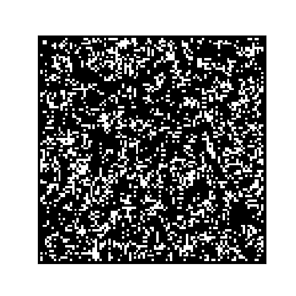
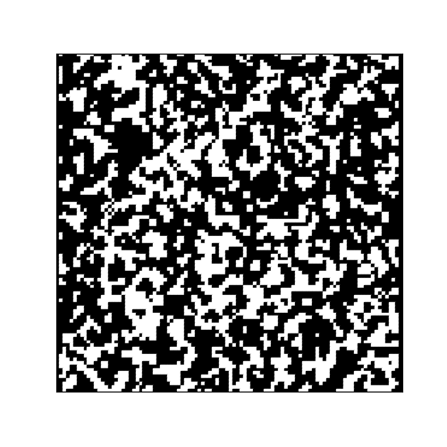
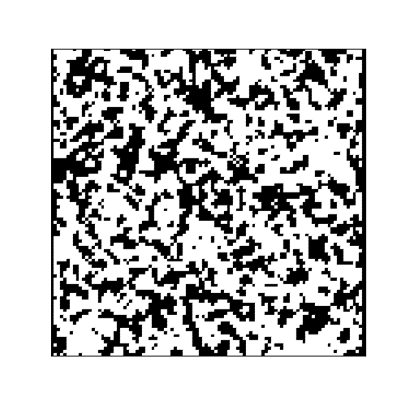

# Cellular-Automata
### A cellular Automata simulation 
A CellularAutomata class manage the updating of the simulation and the animations and the subclases modify the rulesFunction that is used to update the cells.
A couple examples are de Conway's Game of life and an algorithm to smooth out random noise by forming islands and avoiding isolated cells.
<!---

--->

The simulations objects have 5 main methods:

 - ***plotSeed()*** generates an image with the initial conditions.

    -**figArgs**: dictionary with figure **kwargs

- ***plotState()*** generates an image with the actual state of the simulation.

    -**figArgs**: dictionary with figure **kwargs

- ***update()*** makes a step in the simulationand ***reset()*** set the seed as simulation state.

- And ***animation()*** generates the animation.

    -**figArgs**: dictionary with figure \*\*kwargs
  
    -**funcArgs**: dictionary with \*\*kwargs for matplotlib.animation.FuncAnimation.
  
    If you want to loop make sure that *repeat* is in True and there's no 'init_func' key in the dictionary,
    thats causes the program to use reset() as init function.
    
    If you want to simulate without time limits you must specifies *'init_func':None* in the dictionary.
    
    -**save**: True if you want to save animation in a GIF.
  
    -**filePath**: Path where the animation will be saved.
  

