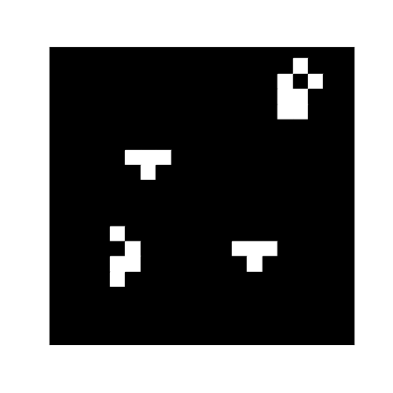
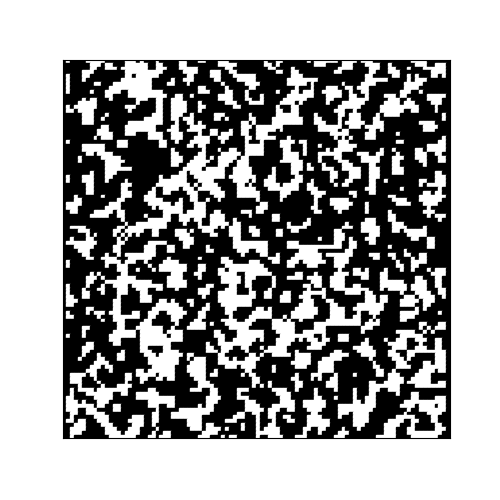
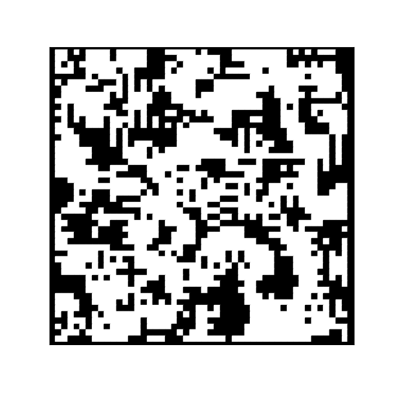

# Cellular-Automata
### A cellular Automata simulation 
A CellularAutomata class manage the updating of the simulation and the animations and the subclases modify the rulesFunction that is used to update the cells.
A couple examples are de Conway's Game of life and an algorithm to smooth out random noise by forming islands and avoiding isolated cells.

